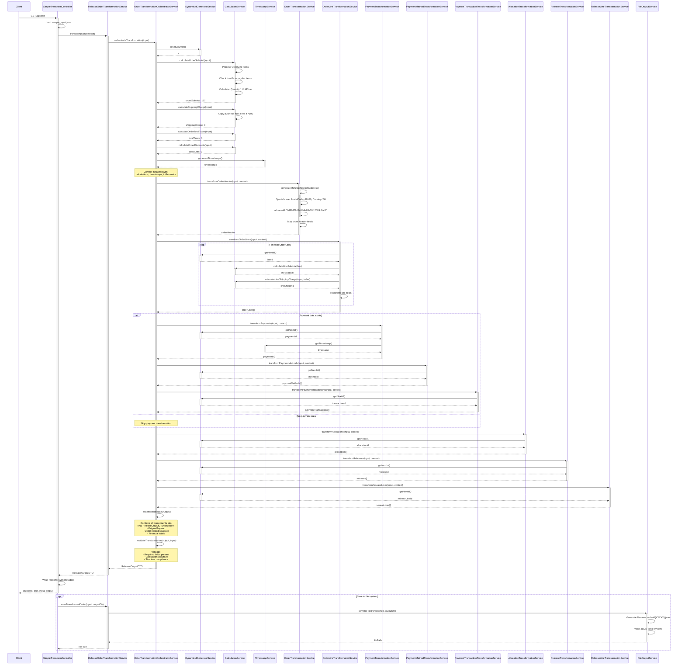
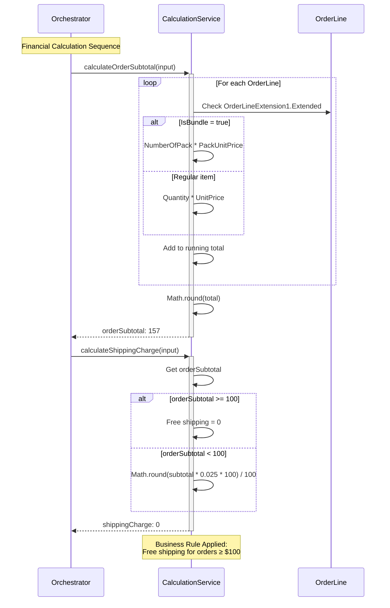
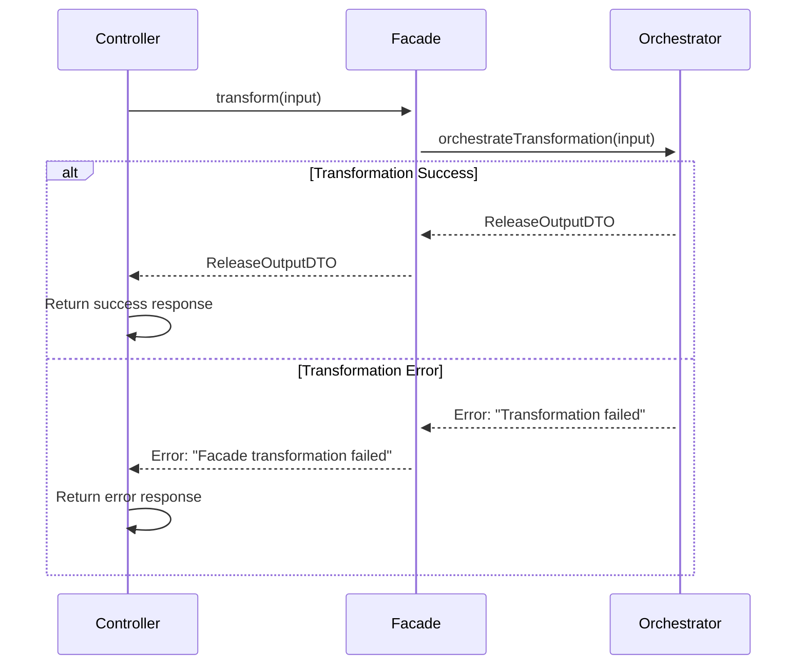

# MAO Service Transformer - Sequence Diagram

## Complete Transformation Flow

## Key Sequence Interactions

### 1. **Initialization & Context Setup**
- ID generator reset for consistent patterns
- Financial calculations performed upfront
- Timestamp generation for deterministic output

### 2. **Domain Service Orchestration**
- Order domain: header + lines transformation
- Payment domain: payments + methods + transactions
- Allocation domain: inventory allocation logic
- Release domain: release + release lines

### 3. **Service Dependencies**
- All services depend on shared utilities (IdGen, CalcSvc, TimeSvc)
- Sequential ID generation ensures consistency
- Calculation service provides business rule compliance

### 4. **Business Rule Enforcement**
- Free shipping calculation (>$100 threshold)
- Address hash generation for deduplication
- Bundle vs regular item price calculations
- Proportional shipping allocation to lines

## Calculation Flow Detail

## Error Handling Flow

This sequence diagram shows the complete flow from HTTP request to final output, including all service interactions, calculations, and error handling paths.